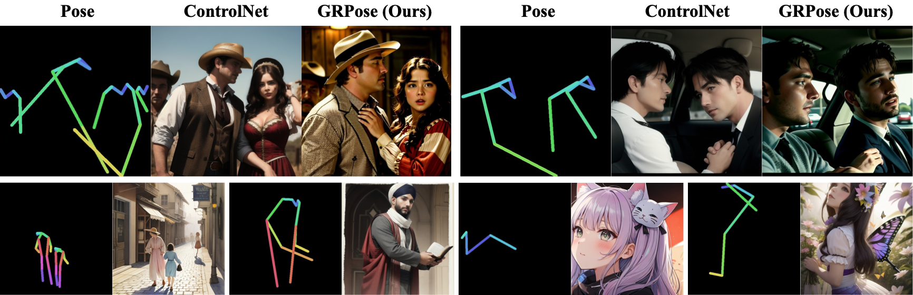
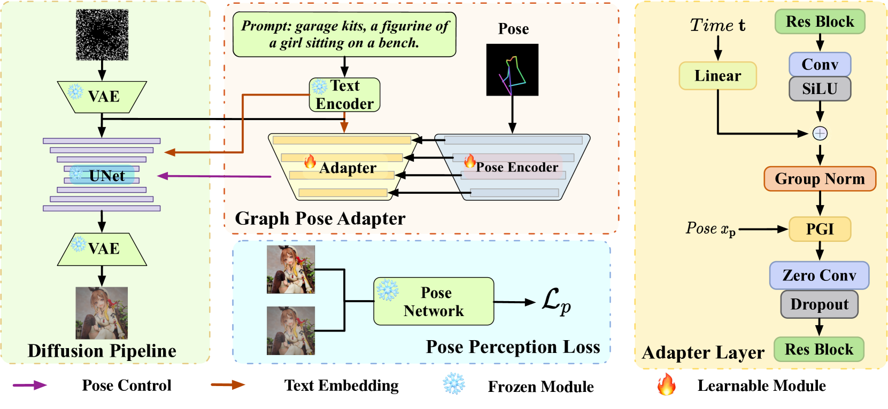

# GRPose: Learning Graph Relations for Human Image Generation with Pose Priors (AAAI 2025)

<div style="display: flex; justify-content: center; align-items: center;">
  <a href="https://arxiv.org/abs/2408.16540" style="margin: 0 2px;">
    
  </a>
  <a href="https://github.com/XiangchenYin/GRPose" style="margin: 0 2px;">
    
  </a>
  <a href='https://XiangchenYin.github.io/grpose_page/' style="margin: 0 2px;">
    
  </a>
</div>

By [Xiangchen Yin](), [Donglin Di](), [Lei Fan](), [Hao Li](), [Chen Wei](), [Xiaofei Gou](), [Yang Song](), [Xiao Sun](), [Xun Yang]()

<div align="center">
  
</div>

## Abstract

Recent methods using diffusion models have made significant progress in human image generation with various additional controls such as pose priors. However, existing approaches still struggle to generate high-quality images with consistent pose alignment, resulting in unsatisfactory outputs. In this paper, we propose a framework delving into the graph relations of pose priors to provide control information for human image generation. The main idea is to establish a graph topological structure between the pose priors and latent representation of diffusion models to capture the intrinsic associations between different pose parts. A Progressive Graph Integrator (PGI) is designed to learn the spatial relationships of the pose priors with the graph structure, adopting a hierarchical strategy within an Adapter to gradually propagate information across different pose parts. A pose perception loss is further introduced based on a pretrained pose estimation network to minimize the pose differences. Extensive qualitative and quantitative experiments conducted on the Human-Art and LAION-Human datasets demonstrate that our model achieves superior performance, with a 9.98% increase in pose average precision compared to the latest benchmark model.

<div align="center">
  
</div>

## Updates
- **`2024/12/25`**: Release the code of inference and evaluation.
- **`2024/12/15`**: Release the code of model and training.
- **`2024/12/10`**: Congratulations! Our **GRPose** has been accepted at AAAI2025.

## Environment

```
conda create -n grpose python=3.10
conda activate grpose
pip install torch==1.13.1+cu116 torchvision==0.14.1+cu116 torchaudio==0.13.1 --extra-index-url https://download.pytorch.org/whl/cu116
pip install -r requirements.txt
```

## Datasets and Pretrain-Models Preparation

You need to prepare the [Human-Art](https://idea-research.github.io/HumanArt/) and [LAION-Human](https://arxiv.org/pdf/2304.04269) datasets to train models, the data path is set in config files.


We provided pretrain model checkpoint here： [huggingface](https://huggingface.co/suxi123/GRPose/tree/main), then you can run this commond to get init grpose weights.

```python
python prepare_weights.py models/v1-5-pruned.ckpt configs/grpose/humanart.yaml models/init_grpose.ckpt
```

The pretrain model dir as follows:

```
|-- models/
  |-- clip-vit-large-patch14/
  |-- v1-5-pruned.ckpt  
  |-- higherhrnet_w48_humanart_512x512_udp.pth 
  |-- mobilenetv2_coco_512x512-4d96e309_20200816.pth
  |-- init_grpose.ckpt  
```

## Train the models

Training shell file is provide:

```
sh train.sh
```

You can also directly run as follows:

```
python train.py --config configs/grpose/humanart.yaml --max_epochs 40 \
--control_ckpt models/init_grpose.ckpt --devices 8 --scale_lr false
```

The training weights will be saved in `experiments` dir.

## Evaluate the models

Due to the problem of the mmpose version, we provide an available mmpose code, which is in `utils/mmpose-0.x.zip`. We install mmpose to evaluate the pose alignment of the model.

```
cd utils && unzip mmpose-0.x.zip
cd mmpose-0.x 
pip install -e .
```

Evaluation shell file is provide:

```
sh infer.sh
```

You can also directly run at multiple gpus:

```
python eval_pose-multiGPU.py --config_model configs/grpose/humanart.yaml \
--ckpt experiments/grpose/grpose_HumanArt-8-L40S/epoch=000035.ckpt \
--batch_size 4 --gpus 0,1,2,3
```

The test set will be split according to the number of gpus to adopt parallel evaluation . You can also run the single gpu evaluation

```
python eval_pose.py --config_model configs/grpose/humanart.yaml --ckpt experiments/grpose/grpose_HumanArt-8-L40S/epoch=000031.ckpt
```

The predict results will be saved in `outputs` and the quantitative results are saved in `metrics`.


## Star History

[](https://star-history.com/#XiangchenYin/GRPose&Date)


## Citation

```
@article{yin2024grpose,
  title={Grpose: Learning graph relations for human image generation with pose priors},
  author={Yin, Xiangchen and Di, Donglin and Fan, Lei and Li, Hao and Wei, Chen and Gou, Xiaofei and Song, Yang and Sun, Xiao and Yang, Xun},
  journal={arXiv preprint arXiv:2408.16540},
  year={2024}
}
```

## Acknowledgments

The project is designed on [ControlNet](https://github.com/lllyasviel/ControlNet), [HumanSD](https://github.com/IDEA-Research/HumanSD), [Stable-Pose](https://github.com/ai-med/StablePose), [ViG](https://github.com/huawei-noah/Efficient-AI-Backbones) and [HumanArt](https://idea-research.github.io/HumanArt/), thanks to these works!

